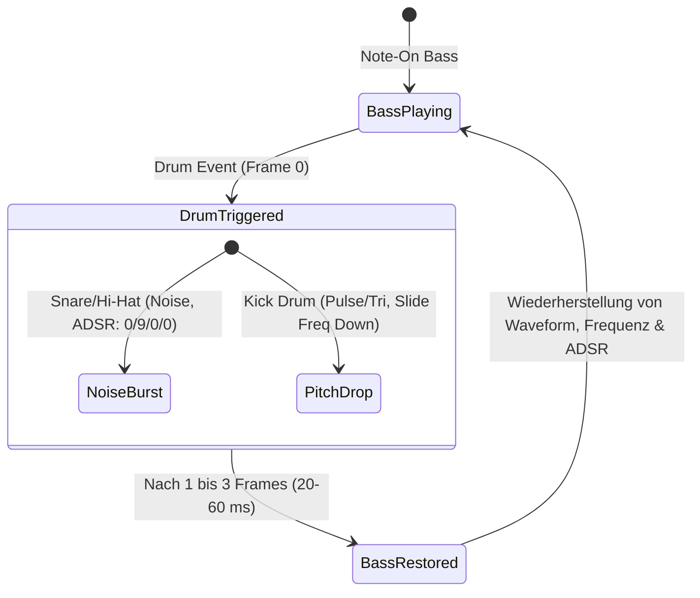

# Musikalische & Technische Charakteristika der Kompositionen von Rob Hubbard
## Kompendium & Kompositions-Blueprint für den *Rob Hubbard SID Composer*

---

## 1. Executive Summary & Zielsetzung

Dieses Dokument liefert eine tiefgehende musikwissenschaftliche, soundtechnische und algorithmische Analyse aller 19 im Korpus befindlichen `.sid`-Kompositionen von **Rob Hubbard** (1985–1987 auf dem MOS Technology 6581 SID-Chip des Commodore 64).

Ziel dieser Analyse ist es, als **verbindliche Spezifikation, Wissensbasis und Regelwerk für einen autonomen oder semi-autonomen Rob-Hubbard-Musikgenerator/Composer** zu dienen. Der Composer soll in der Lage sein, vollwertige, stilistisch unverkennbare `.sid`-Musikstücke zu generieren, die Hubbards typische Harmonik, Melodieführung, rhythmische Energie, Voice-Multiplexing-Mechanik und SID-Klangästhetik perfekt replizieren.

---

## 2. Detaillierte Werkanalyse der 19 SID-Dateien

In der folgenden Tabelle sind die 19 untersuchten Original-SIDs mit ihren technischen Parametern, musikalischen Merkmalen und historischen Kontexten aufgeführt:

| Dateiname | Titel | Jahr / Publisher | Songs | Ladeadr. | Init | Play | Tempo (BPM) | Tonart / Modus | Stil / Signature-Elemente |
|:---|:---|:---:|:---:|:---:|:---:|:---:|:---:|:---:|:---|
| `Monty_on_the_Run.sid` | Monty on the Run | 1985 Gremlin | 19 | `$8000` | `$8000` | `$8012` | ~146 | E-Moll / A-Moll | High-Speed Virtuoso Violin-Rock; 32tel-Skalenläufe; Devil's Gallop Hommage; Slap-Bass. |
| `Commando.sid` | Commando | 1985 Elite | 19 | `$5000` | `$5FB2` | `$5012` | ~124 | B-Moll / D-Dur | Militärmarsch trifft Funk-Rock; Snare-Rolls; Pitch-Scoops bei Brass-Leads; Oktav-Slap-Bass. |
| `Delta.sid` | Delta | 1987 Thalamus | 13 | `$BC00` | `$C357` | `$BDE4` | ~128 | D-Moll / C-Moll | Minimal Music / Space Rock (Philip Glass / Pink Floyd inspiriert); Filter-Resonanz-Sweeps; 5/4-Metrik; Arpeggio-Phasenverschiebung. |
| `Sanxion.sid` | Sanxion | 1986 Thalamus | 2 | `$B000` | `$BE00` | `$BE20` | ~132 | G-Moll / C-Moll | Neoklassische / russische Dramatik ("Thalamusic"); Sweeping PWM; 16tel-Bass-Motorik; Vibrato-Melodik. |
| `IK_plus.sid` | International Karate + | 1987 System 3 | 3 | `$E000` | `$F150` | `$F17C` | ~110 | A-Moll / D-Dorisch | Fernöstliche Pentatonik verschmilzt mit Jazz-Funk; Ring-Modulation; Slap-Bass; Gong-Synthese. |
| `Crazy_Comets.sid` | Crazy Comets | 1985 Martech | 17 | `$5000` | `$6100` | `$500C` | ~130 | F#-Moll / A-Dur | Jean-Michel Jarre Space-Disco; durchgehender 32tel-Arpeggio-Teppich; Filter-Sweeps; Laser-Pitch-Drops. |
| `Lightforce.sid` | Lightforce | 1986 FTL | 1 | `$F000` | `$F0B9` | `$F0BF` | ~125 | D-Moll / F-Dur | Progressive Fusion-Rock-Hymne; zweistimmige Terz-/Sext-Harmonien; modale Akkordwechsel; epische Spannungsbögen. |
| `Spellbound.sid` | Spellbound | 1986 Mastertronic | 13 | `$E000` | `$EFE4` | `$E012` | ~92 | C-Moll / Eb-Dur | Melancholische Barock-/Klassik-Ballade; Querflöten-Timbre; Vorhaltsauflösungen ($4\to 3$); Quintfallsequenz. |
| `Master_of_Magic.sid` | The Master of Magic | 1985 Mastertronic | 3 | `$BFF8` | `$BFF8` | `$BFFB` | ~108 | A-Moll / C-Dur | Kosmischer Fantasy-Prog (Larry Fast / Synergy Inspiration); dichte PWM-Flächen; Resonanzfilter-Texturen. |
| `Last_V8.sid` | The Last V8 | 1985 Mastertronic | 17 | `$8010` | `$8080` | `$0000` | ~136 | E-Moll / D-Moll | Dystopischer Cyber-Rock; Hard-Sync- und Ringmod-Verzerrung (Motorgeräusch-Emulation); schwere Subbässe. |
| `Knucklebusters.sid` | Knucklebusters | 1986 Melbourne H. | 11 | `$0400` | `$1EC0` | `$1ED4` | Variabel | A-Moll / D-Moll | 17-Minuten Prog-Rock-Suite; mehrsätzige Struktur; dynamische Filtermodulations-Fahrten; fugenhafte Kontrapunkte. |
| `Mega_Apocalypse.sid` | Mega Apocalypse | 1987 Martech | 11 | `$0800` | `$5822` | `$0000` | ~150 | G-Moll / D-Moll | Klassik-Metal Fusion (Saint-Saëns Danse Macabre / Liszt Zitate); Double-Bassdrum-Pattern; High-Speed Gitarren-Soli. |
| `Nemesis_the_Warlock.sid` | Nemesis the Warlock | 1987 Martech | 15 | `$E000` | `$F160` | `$F190` | ~116 | D-Moll / G-Moll | Gotischer Dark-Prog / Sakraler Orgel-Synth; Dreieck+Rechteck Pfeifenorgel-Simulation; opernhafte Dramatik. |
| `Kentilla.sid` | Kentilla | 1986 Mastertronic | 1 | `$AB00` | `$AB00` | `$AB06` | ~112 | D-Dorisch / A-Moll | Mittelalterlich-keltisches Fantasy-Epos; Lauten-/Harfen-Arpeggien; modale Volksweisen; pastorale Idylle zu heroischem Marsch. |
| `Warhawk.sid` | Warhawk | 1986 Firebird | 18 | `$1000` | `$1F53` | `$1012` | ~140 | A-Moll / C-Moll | Sci-Fi Action-Hymne; heroische Brass-Leads; treibende 16tel-Bassline mit integrierter Drum-Interleaving-Engine. |
| `Flash_Gordon.sid` | Flash Gordon | 1986 Mastertronic | 29 | `$1000` | `$2400` | `$2420` | ~128 | F-Moll / Bb-Moll | Sci-Fi Heroic Rock; markante Pitch-Bends; perkussive Rhythmuswechsel; prägnante Call-and-Response Phrasen. |
| `Chimera.sid` | Chimera | 1985 Firebird | 4 | `$9F80` | `$9F80` | `$0000` | ~120 | C-Moll / G-Moll | Elektro-Funk / Acid-Synthesizer; synkopierte Riffs; experimentelle Pitch-Sweeps; polyphone Rhythmusüberlagerungen. |
| `I_Ball.sid` | I, Ball | 1987 Firebird | 4 | `$9000` | `$C206` | `$0000` | ~132 | G-Dur / E-Moll | Upbeat Arcade Funk-Pop; Slap-Bass Akzente; eingängige Chiptune-Hooklines; heitere, tanzbare Rhythmik. |
| `Zoids.sid` | Zoids | 1986 Martech | 3 | `$1000` | `$1000` | `$1006` | ~122 | E-Moll / B-Phrygisch | Mechanischer Industrial / Heavy Synth-Metal; Powerchord-Simulation über Schnell-Arps; düstere Riffs. |

---

## 3. Die 5 stilistischen Archetypen (Hubbard-Genres)

Rob Hubbards Repertoire lässt sich in fünf klar definierte musikalische Archetypen einteilen, die ein Composer-Modell gezielt als Templates ansteuern kann:

```
                          ┌───────────────────────────────┐
                          │   ROB HUBBARD STIL-KORPUS     │
                          └──────────────┬────────────────┘
         ┌──────────────────┬────────────┴───────┬──────────────────┬─────────────────┐
         ▼                  ▼                    ▼                  ▼                 ▼
   [ARCHETYP 1]       [ARCHETYP 2]         [ARCHETYP 3]       [ARCHETYP 4]      [ARCHETYP 5]
 Virtuosen-Galopp    Progressive Space    Barock & Romantik    Jazz-Funk Fusion   Dystopian Cyber
  & Speed-Action      & Minimal Suite       Fantasy-Ballade    & Chiptune-Dance   & Heavy Metal
 (Monty, Commando,   (Delta, Lightforce,  (Spellbound,         (IK+, Chimera,     (Last V8, Zoids,
  Warhawk, Mega-Ap.)  Sanxion, Knuckleb.)  Kentilla, M.o.M.)    I-Ball)            Nemesis)
```

### Archetyp 1: Der Virtuosen-Galopp & High-Speed Action (z. B. *Monty on the Run*, *Commando*)
- **Tempo:** 135–155 BPM.
- **Rhythmus:** Unablässiger 16tel-Galopp ("Devil's Gallop" / Rossini / Williams Feel), synkopierte Slap-Bässe, dichte Snare-Rolls auf Stimme 3.
- **Melodie:** Solovioline / Lead-Gitarre simuliert durch ultra-schnelle 32tel-Läufe, Arpeggio-Akkordbrechungen, chromatische Anläufe und delayed Vibrato.
- **Stimmung:** Atemlos, virtuos, heroisch, dynamisch.

### Archetyp 2: Das progressive Space-Epos & Minimalist Suite (z. B. *Delta*, *Lightforce*, *Sanxion*)
- **Tempo:** 122–132 BPM.
- **Rhythmus:** Minimalistisch-repetitive 16tel-Phasen, Polyrhythmen (3 gegen 4, 5/4-Metren), motorischer Bass-Puls.
- **Harmonik & Textur:** Weite modale Flächen, analoge Filter-Sweeps (Cutoff LFOs), Phasenverschiebungen, zweistimmige Leads in Terzen und Sexten.
- **Stimmung:** Hypnotisch, kosmisch, cineastisch, expansiv.

### Archetyp 3: Die melancholische Barock- & Fantasy-Ballade (z. B. *Spellbound*, *Kentilla*, *Master of Magic*)
- **Tempo:** 85–115 BPM (Andante / Moderato).
- **Harmonik:** Klassische Quintfallsequenzen ($i - iv - VII - III - VI - ii^\circ - V - i$), Vorhalte ($4\to 3, 9\to 8$), verminderte Durchgangsakkorde, Dur-Auflösung am Schluss (Tierce de Picardie).
- **Sound:** Reines Dreieck / leicht moduliertes Pulssignal, Holzbläser-/Flöten-Vibrato, Lauten-/Harfen-Zupfeffekte.
- **Stimmung:** Schwermütig, edel, nachdenklich, pastoral.

### Archetyp 4: Der Jazz-Funk & Electro-Fusion Groove (z. B. *IK+*, *Chimera*, *I, Ball*)
- **Tempo:** 105–125 BPM (Half-Time Funk Feel).
- **Harmonik:** Jazz-Akkorde ($m^9, sus^4, \text{add}9, maj^7, m^{11}$), Pentatonik (dorisch/moll), modale Einsprengsel.
- **Rhythmus & Bass:** Slap-Bass mit Ghost-Notes, Oktavsprüngen, Ring-Modulation für exotische Gongs/Bells, präzise Snares.
- **Stimmung:** Lässig, groovig, akrobatisch, funky.

### Archetyp 5: Der dystopische Cyber-Rock & Industrial Metal (z. B. *The Last V8*, *Zoids*, *Nemesis*)
- **Tempo:** 115–138 BPM.
- **Harmonik:** Phrygisch, lokrisch, Power-Chords (Grundton + Quinte + Oktave im 50Hz-Arp), chromatische Riffs.
- **Sound:** Hard-Sync ($D404/D40B Bit 1), Ringmod ($D404 Bit 2), stark übersteuerte Resonanzfilter, maschinelle Noise-Percussion.
- **Stimmung:** Aggressiv, futuristisch, apokalyptisch, bedrohlich.

---

## 4. Harmonische DNA & Akkord-Vokabular

Rob Hubbards harmonisches Genie beruht auf der Fusion von **klassischer kontrapunktischer Satztechnik**, **Jazz-Harmonik** und **progressivem Rock**.

### 4.1 Modale Präferenzen und Tonleitern
1. **Äolisch (Natürliches Moll):** Basis für tragische und heroische Themen ($1, 2, \flat 3, 4, 5, \flat 6, \flat 7$).
2. **Dorisch:** Hubbards bevorzugter Modus für fließende Space-Funk-Themen (*Lightforce*, *IK+*, *Kentilla*) durch die markante **große Sexte** ($1, 2, \flat 3, 4, 5, \mathbf{6}, \flat 7$).
3. **Harmonisch Moll:** Für dramatische, barocke Kadenzen mit Leitton ($\mathbf{7}$) und übermäßiger Sekunde ($\flat 6 \to 7$).
4. **Moll-Pentatonik & Blues-Scale:** Für Lead-Soli und Riffs, angereichert mit der verminderten Quinte ($\flat 5$ / Blue Note).
5. **Fernöstliche Pentatonik (In-Scale / Kumoi):** In *IK+* gezielt über Halbtöne kombiniert ($1, \flat 2, 4, 5, \flat 6$ oder $1, 2, \flat 3, 5, \flat 6$).

### 4.2 Bevorzugte Akkordtypen & Voicings
Da der SID-Chip nur 3 Stimmen besitzt, erzeugte Hubbard komplexe Jazz- und Orchesterakkorde durch **ultraschnelle Arpeggios (Arp-Tables)** auf einer einzigen Stimme:

- **Moll 7 ($m^7$):** $[0, 3, 7, 10]$
- **Moll 9 ($m^9$):** $[0, 3, 7, 10, 14]$
- **Moll 11 ($m^{11}$):** $[0, 3, 7, 10, 14, 17]$ – erzeugt den schwebenden *Lightforce*-Klang.
- **Suspended 4 ($sus^4$):** $[0, 5, 7] \to$ Auflösung nach $[0, 4, 7]$
- **Major 7 ($maj^7$):** $[0, 4, 7, 11]$
- **Halbverminderter Septakkord ($m7\flat 5$):** $[0, 3, 6, 10]$ – für dramatische Kadenzen nach $V^7$.
- **Powerchord-Arp ($P5/8$):** $[0, 7, 12]$ – für harte Rock-Riffs (*Zoids*).

### 4.3 Typische Akkordverbindungen (Progression Patterns)

#### Muster A: Die klassische Hubbard-Quintfall-Kette (Circle of Fifths)
Verwendet in *Monty on the Run*, *Spellbound*, *Lightforce*:
$$\mathbf{i \to iv^7 \to VII^7 \to III^{maj7} \to VI^{maj7} \to ii^{\circ7} \to V^7 \to i}$$
*Beispiel in D-Moll:* $Dm \to Gm7 \to C7 \to Fmaj7 \to Bbmaj7 \to Edim \to A7 \to Dm$

#### Muster B: Das modale Dorisch/Äolisch-Vamp (Space Funk)
Verwendet in *Lightforce*, *Sanxion*:
$$\mathbf{i \to \flat VII \to \flat VI \to \flat VII \quad \text{oder} \quad i \to IV \to i \to IV \quad (\text{Dorischer Pendel})}$$
*Beispiel:* $Dm \to C \to Bb \to C$ bzw. $Dm7 \to G7 \to Dm7 \to G7$

#### Muster C: Der chromatische Bass-Step-Down (Lamento-Bass)
$$\mathbf{i \to i^{(maj7)/7} \to i^{7/\flat 7} \to IV^{(6)/6} \to \flat VI \to V \to i}$$
*Beispiel:* $Am \to Am/G\# \to Am/G \to D/F\# \to F \to E7 \to Am$

#### Muster D: Pedalton-Ostinato mit wechselnden Dreiklängen
Verwendet in *Delta*, *IK+*:
Im Bass verharrt stur der Grundton (z. B. $D$), während die Arpeggio-Stimme darüber modale Dreiklänge schichtet:
$$\frac{D}{D} \to \frac{C}{D} \to \frac{Bb}{D} \to \frac{C}{D} \quad \text{oder} \quad \frac{Dm}{D} \to \frac{Em}{D} \to \frac{F}{D} \to \frac{G}{D}$$

---

## 5. Melodieführung & Solotechnik (The "Hubbard Lead")

Das herausragende Merkmal von Rob Hubbards Melodien ist ihr **gesanglicher, virtuoser Instrumentencharakter** – sie klingen nicht nach statischen Computertönen, sondern wie lebendig gespielte E-Gitarren, Synthesizer-Soli oder Violinen.

```
       Pitch
         ▲
         │                                       ~~~~ Delayed Vibrato ~~~~
  Target ├─── ─ ─ ─ ─ ─ ─ ─ ─ ─ ─ ─ ─ ─ ─ ─ ─ ─ ┌─┐   ┌─┐   ┌─┐   ┌─┐   ┌─┐
  Pitch  │                           /───────────┘ └───┘ └───┘ └───┘ └───┘ └───
         │                   /───────
         │           /───────  (Pitch Scoop / Portamento)
  Start  │   /───────
  Pitch  └───┴───────────────────────┬───────────────────────────────► Zeit (Frames)
          Frame 0                 Frame 3..5                      Frame 8..Ende
```

### 5.1 Die vier Säulen des Hubbard-Lead-Sounds

1. **Der Pitch-Scoop (Attack-Slide):**
   - Nahezu jede akzentuierte Lead-Note startet $1$ bis $3$ Halbtöne unter der Zieltonhöhe.
   - Innerhalb von $2$ bis $5$ Frames (40–100 ms) gleitet die Frequenz exponentiell auf die Soll-Note.
   - Dies imitiert das Bending einer E-Gitarrensaite oder den Ansatz eines Blechbläsers.

2. **Das verzögerte Vibrato (Delayed Vibrato):**
   - Bei gehaltenen Noten ist das Vibrato **nie** von Frame 0 an aktiv!
   - **Phase 1 (Attack & Sustain):** Note bleibt für $4$ bis $10$ Frames vollkommen glatt und rein.
   - **Phase 2 (Onset):** Vibrato setzt langsam ein (Frequenzmodulation via Dreiecks- oder Sinus-LFO mit ca. 5–7 Hz).
   - **Phase 3 (Depth):** Modulationstiefe nimmt bei langen Noten leicht zu.

3. **Virtuose Kaskadenläufe & Verzierungen:**
   - Eingeschobene 32tel- und 64tel-Notenläufe über Skalen (Diatonisch, Harmonisch Moll, Blues).
   - Wechselnoten, Doppelschläge und Triller (schnelles Hin- und Herspringen zwischen 2 Halbtönen um 1 Frame Taktung).
   - Oktav-Sprünge mit anschließendem Glissando.

4. **Zweistimmige Terz- und Sext-Harmonisierung:**
   - In festlichen oder hymnischen Abschnitten (*Lightforce*, *Warhawk*, *Commando*) führt Stimme 2 die Hauptmelodie in konsonanten Intervallen (große/kleine Terz, Quarte, Sexte) parallel mit.

---

## 6. Rhythmus-Maschinerie, Basslines & "Voice Multiplexing"

Aufgrund der harten Limitierung auf 3 Oszillatoren erfand Rob Hubbard das **dynamische Voice-Stealing / Multiplexing** auf Stimme 3 zur Perfektion.

### 6.1 Die Hubbard 3-Stimmen-Architektur

```
┌────────────────────────────────────────────────────────────────────────┐
│                          SID CHIP (3 STIMMEN)                          │
├───────────┬────────────────────────────────────────────────────────────┤
│ STIMME 1  │ HAUPTMELODIE / LEAD-SOLO / THEMA                           │
│           │ Waveform: Pulse (PWM) / Sägezahn / Sync; Filter-Routing    │
├───────────┼────────────────────────────────────────────────────────────┤
│ STIMME 2  │ HARMONIE-TEPPICH / SCHNELL-ARPEGGIO (CHORD) / COUNTERPOINT │
│           │ Waveform: Pulse / Saw / Tri; 50Hz/60Hz Arp-Tabellen        │
├───────────┼────────────────────────────────────────────────────────────┤
│ STIMME 3  │ BASSLINE + SCHLAGZEUG MULTIPLEXING (DRUM STEALING)         │
│ (Shared!) │ [Bassnote] ──► [Snare/Kick Hit (1-3 Fr.)] ──► [Bassnote]   │
└───────────┴────────────────────────────────────────────────────────────┘
```

### 6.2 Die Drum-Stealing-Zustandsmaschine (Voice 3 Multiplexer)

Wenn ein Schlagzeug-Schlag (Bassdrum, Snare, Hi-Hat, Tom) fällig ist, unterbricht die Engine die Bassnote für wenige Frames:



**Konsequenz für das Gehirn des Hörers:**
Das menschliche Gehör nimmt den harten transienten Knall des Schlagzeugs wahr und interpoliert den unmittelbar danach einsetzenden Basston. Das Stück klingt subjektiv wie **4 vollwertige Instrumente** (Lead + Chords + Bass + Drums)!

### 6.3 Sounddesign der Hubbard-Drums auf Stimme 3

1. **Snare Drum (Der legendäre Hubbard-Snare-Crack):**
   - **Frame 0:** Waveform = `$81` (Noise + Gate On), Frequenz = `$7000`–`$9000`, ADSR = `$08` / `$00` (Sofortiger Attack, schneller Decay).
   - **Frame 1:** Frequenz fällt auf `$3000` ab.
   - **Frame 2:** Gate = 0, Umschalten zurück zur Bass-Frequenz und Bass-Waveform.
2. **Bass Drum (Der Punchy Kick):**
   - **Frame 0:** Waveform = `$11` (Dreieck), Frequenz = `$1200`, ADSR = `$09` / `$00`.
   - **Frame 1:** Frequenz fällt rapide auf `$0300` (Pitch-Drop).
   - **Frame 2:** Frequenz fällt auf `$0100` $\to$ Gate = 0.
3. **Hi-Hat / Cymbal:**
   - **Frame 0:** Waveform = `$81` (Noise), Frequenz = `$D000` (extrem hoch), ADSR = `$05` / `$00`.
   - **Frame 1:** Sofort zurück zu Bass.
4. **Snare-Roll (Militärischer Wirbel, z. B. *Commando*):**
   - Rasche Abfolge von 32tel-Noise-Triggern mit variierender Frequenz (`$4000` $\leftrightarrow$ `$6000`), die eine dynamische Trommelwirbel-Hüllkurve erzeugen.

### 6.4 Slap-Bass-Muster
- **Oktav-Popping:** 16tel-Muster, bei dem der Grundton auf Zählzeit 1 kurz angespielt wird und auf der 16tel-Offbeat-Zählzeit ein harter Oktavsprung mit extrem kurzem Gate folgt ($1-8-1-8$).
- **Ghost Notes:** Ungestimmte, ultrakurze perkussive Klicks vor dem eigentlichen Hauptton.

---

## 7. Sounddesign & SID-Register-Beherrschung (`$D400`–`$D418`)

Rob Hubbard schöpfte die analog-digitale Hybridarchitektur des MOS 6581 meisterhaft aus.

### 7.1 Pulsweitenmodulation (PWM / Chorus-Engine)
Für breite, fette Synthesizerflächen und warme Lead-Sounds nutzte Hubbard dynamische Pulsweiten-Sweeps:
- **Register:** `$D402/$D403` (Stimme 1 PW), `$D409/$D40A` (Stimme 2 PW), `$D410/$D411` (Stimme 3 PW).
- **Algorithmus:** Ein Software-LFO zählt den 12-Bit-Wert kontinuierlich hoch und runter:
  $$\text{PW}_{\text{neu}} = \text{PW}_{\text{alt}} \pm \Delta \text{Speed} \quad (\text{Wertebereich: } \$0200 \dots \$0E00)$$
- **Fester asymmetrischer Puls:** Für schneidende, nasale Oboen- oder Lead-Sounds feste Pulsbreiten von ca. 12.5% (`$0200`) oder 25% (`$0400`).

### 7.2 Dynamische Filtermodulation (Analog Multimode Filter)
Hubbard war einer der Pioniere, die den SID-Filter in Echtzeit modulierten:
- **Cutoff-Register:** `$D415` (Low 3 Bits), `$D416` (High 8 Bits) $\to$ 11-Bit Cutoff-Frequenz.
- **Resonanz & Routing:** `$D417` (High Nibble = Resonanz $0\dots F$; Low Nibble = Voice 1/2/3 Filter Enable).
- **Filter Mode:** `$D418` (Lowpass, Bandpass, Highpass, 3-Off).
- **Hubbard-Filter-Routings:**
  1. **Space-Sweep (*Delta*, *Sanxion*):** Bandpass + Lowpass aktiv, Resonanz auf `$C` bis `$E`, Cutoff fährt per LFO langsam von `$0100` bis `$07FF` auf und ab. Stimme 1 & 2 gefiltert, Stimme 3 (Bass/Drums) **ungefiltert**, um Druck und Punch nicht zu verlieren!
  2. **Acid-Squelch / Wah-Wah:** Schneller Decay-Filter-Envelope auf jedem Melodieanschlag (Cutoff springt bei Note-On auf Maximum und fällt linear ab).

### 7.3 Hard Sync & Ring Modulation
- **Hard Sync (`$D404` Bit 1):** Oszillator 1 wird durch Oszillator 3 zwangssynchronisiert. Erzeugt obertonreiche, metallische, sägende Lead-Klänge (*The Last V8*, *Zoids*).
- **Ring Modulation (`$D404` Bit 2):** Dreieckswelle von Stimme 1 wird mit Stimme 3 multipliziert. Erzeugt unharmonische, glockenartige, metallische Gongs (*IK+*, *Chimera*).

---

## 8. Form, Makro-Struktur & Dynamischer Spannungsaufbau

Ein typisches Rob-Hubbard-Stück ist **kein simpler 4-Takt-Loop**, sondern eine durchkomponierte progressive Suite.

### 8.1 Das progressive Suiten-Modell (z. B. *Lightforce*, *Sanxion*, *Knucklebusters*)

```
[INTRO] ──► [HAUPTTHEMA A] ──► [KONTRA-THEMA B] ──► [BRIDGE / MODULATION] ──► [VIRTUOSEN-SOLO] ──► [BREAKDOWN] ──► [GRAND REPRISE]
 8 Takte       16 Takte            16 Takte              8 Takte                 16-32 Takte          8 Takte           16 Takte
 Drone /       Zweistimmig        Neuer Modus /       Quintfall-Wechsel       Skalenläufe,        Filter-Sweep,      Full Power,
 Filter-       Lead + Arp +       Subdominant-        in neue Tonart          Pitch-Scoops,       Drums solo,        Höchste Oktave,
 Sweep         Bass Groove        Wechsel                                     Delayed Vibrato     Atmosphäre         Coda
```

### 8.2 Typische Übergangstechniken (Transitions)
1. **Der Chromatic Snare Riser:** Vor dem Einsatz eines neuen Teils rollt die Snare über 2 Takte in 16teln/32teln hoch, während der Bass chromatisch ansteigt ($\dots \to F \to F\# \to G$).
2. **Der Silence/Breakdown-Drop:** Vollständiger Stopp aller Stimmen auf Zählzeit 4, gefolgt von einem einzelnen Sub-Bass-Hit oder Laser-Slide auf Zählzeit 1 des neuen Teils.
3. **Die Modulation um eine kleine Terz / Ganzton:** Übergang von D-Moll nach F-Moll oder E-Moll, um die Energie im Solo-Teil dramatisch zu steigern.

---

## 9. System-Architektur & Algorithmen für den *Rob Hubbard Composer*

Um einen autonomen Generator für Hubbard-Musik zu implementieren, sollte die Software in folgende 7 Module strukturiert sein:

```
┌─────────────────────────────────────────────────────────────────────────────┐
│                    ROB HUBBARD COMPOSER - MODULSTRUKTUR                     │
├─────────────────────────────────────────────────────────────────────────────┤
│ 1. FORM-PLANNER & ARCHEZEICHNER (Macro Structure Engine)                    │
│    Wählt Genre-Archetyp, Tonart, BPM, Taktart, Satzfolge (Intro, A, B, ...) │
├─────────────────────────────────────────────────────────────────────────────┤
│ 2. HARMONIE- & PROGRESSIONS-GENERATOR                                       │
│    Erzeugt Quintfallsequenzen, Dorische Vamps, Lamento-Bässe, Kadenzen      │
├─────────────────────────────────────────────────────────────────────────────┤
│ 3. MELODIE- & VIRTUOSEN-SOLO-ENGINE (Voice 1)                               │
│    Generiert Lead-Linien, Pitch-Scoops, Delayed Vibrato, 32tel-Läufe         │
├─────────────────────────────────────────────────────────────────────────────┤
│ 4. SCHNELL-ARPEGGIO- & TEXTUR-GENERATOR (Voice 2)                           │
│    Baut 50Hz/60Hz Arpeggio-Tabellen, PWM-Pads, 2nd Voice Harmonisierung     │
├─────────────────────────────────────────────────────────────────────────────┤
│ 5. BASS- & DRUM-MULTIPLEXER (Voice 3 Scheduler)                             │
│    Erzeugt Slap-Basslines, schleift Drum-Events (Kick, Snare, Hat) frame-   │
│    genau ein und stellt Bassnoten nach 1-3 Frames wieder her                │
├─────────────────────────────────────────────────────────────────────────────┤
│ 6. SID-PATCH- & FILTER-AUTOMATIONSMASCHINE                                  │
│    Verwaltet Cutoff-LFOs, Resonanzen, Waveform-Wechsel, Hard-Sync/Ring-Mod  │
├─────────────────────────────────────────────────────────────────────────────┤
│ 7. COMPILER & EXPORTER (SID / ASM / MIDI / Tracker)                         │
│    Kompiliert Player-Tables direkt in 6502-Assembly & PSID-Format           │
└─────────────────────────────────────────────────────────────────────────────┘
```

### 9.1 Pseudocode: Voice 3 Multiplexer Engine (Frame-Ebene @ 50Hz)

```python
class Voice3Multiplexer:
    def __init__(self):
        self.drum_active = False
        self.drum_timer = 0
        self.current_bass_note = None
        self.current_bass_instrument = None

    def trigger_drum(self, drum_type):
        self.drum_active = True
        self.drum_timer = drum_type.duration_frames  # 1 to 3 frames
        # Sofort SID-Register für Drum setzen
        sid.write(0xD412, drum_type.attack_decay)    # ADSR
        sid.write(0xD413, drum_type.sustain_release)
        sid.write(0xD40E, drum_type.freq_low)        # Freq
        sid.write(0xD40F, drum_type.freq_high)
        sid.write(0xD414, drum_type.waveform)        # Noise ($81) / Pulse ($41)

    def trigger_bass_note(self, note, instrument):
        self.current_bass_note = note
        self.current_bass_instrument = instrument
        if not self.drum_active:
            self._apply_bass_to_sid()

    def tick_frame(self):
        if self.drum_active:
            self.drum_timer -= 1
            if self.drum_timer <= 0:
                # Drum beendet -> Sofort Bassnote nahtlos restaurieren!
                self.drum_active = False
                self._apply_bass_to_sid()

    def _apply_bass_to_sid(self):
        if self.current_bass_note is not None:
            freq = note_to_sid_freq(self.current_bass_note)
            inst = self.current_bass_instrument
            sid.write(0xD412, inst.attack_decay)
            sid.write(0xD413, inst.sustain_release)
            sid.write(0xD40E, freq & 0xFF)
            sid.write(0xD40F, (freq >> 8) & 0xFF)
            sid.write(0xD414, inst.waveform)  # z.B. Saw ($21) oder Pulse ($41)
```

### 9.2 Pseudocode: Melodie-Phrasierung & Pitch-Scoop Generator

```python
def generate_hubbard_melody_note(target_pitch, duration_ticks, is_accented):
    events = []
    
    if is_accented and duration_ticks >= 6:
        # Pitch-Scoop: Startet 2 Halbtöne tiefer und slidet in 3 Frames hoch
        start_pitch = target_pitch - 2
        events.append(FrameEvent(frame=0, pitch=start_pitch, gate=True, vibrato=False))
        events.append(FrameEvent(frame=1, pitch=target_pitch - 1, gate=True, vibrato=False))
        events.append(FrameEvent(frame=2, pitch=target_pitch, gate=True, vibrato=False))
    else:
        events.append(FrameEvent(frame=0, pitch=target_pitch, gate=True, vibrato=False))
        
    # Delayed Vibrato: Setzt erst ab Frame 6 ein
    if duration_ticks > 8:
        for f in range(6, duration_ticks):
            # Sinus/Dreiecks-LFO Modulation
            lfo_offset = math.sin((f - 6) * 0.8) * 0.35  # Microtonale Abweichung
            events.append(FrameEvent(frame=f, pitch=target_pitch + lfo_offset, gate=True, vibrato=True))
            
    return events
```
---

## 10. Der 50-Kriterien-Analyse- & Generierungs-Katalog für den SID-Composer

Um die vorliegenden 19 SID-Dateien automatisiert zu dekonstruieren und daraus generative Algorithmen (z. B. Markov-Modelle, probabilistische Grammatiken, neuronale Netze oder regelbasierte Expertensysteme) abzuleiten, sind die folgenden **50 Kriterien in 10 Dimensionen** definiert.

Jedes Kriterium beschreibt den **Analyse-Fokus**, das **mathematisch-algorithmische Datenmuster** sowie dessen **direkte Anwendung bei der Komposition**.

```
┌──────────────────────────────────────────────────────────────────────────────────────────────────┐
│                             DIE 10 ANALYSE- & GENERIERUNGS-DIMENSIONEN                           │
├────────────────────────────────┬────────────────────────────────┬────────────────────────────────┤
│ 1. Makro-Struktur & Dramaturgie│ 2. Tonalität & Harmonik-Graph  │ 3. Bassline-Architektur        │
│    (Kriterien 1–5)             │    (Kriterien 6–10)            │    (Kriterien 11–15)           │
├────────────────────────────────┼────────────────────────────────┼────────────────────────────────┤
│ 4. Melodieführung & Virtuosität│ 5. Micro-Pitch & Artikulation  │ 6. Voice-Multiplexing & 3-Voice│
│    (Kriterien 16–20)           │    (Kriterien 21–25)           │    (Kriterien 26–30)           │
├────────────────────────────────┼────────────────────────────────┼────────────────────────────────┤
│ 7. Percussion- & Drum-Synthese │ 8. Arpeggio-Tabellen & Timbre  │ 9. PWM & Filter-Automation     │
│    (Kriterien 31–35)           │    (Kriterien 36–40)           │    (Kriterien 41–45)           │
├────────────────────────────────┴────────────────────────────────┴────────────────────────────────┤
│ 10. Low-Level 6502-Treiber, ADSR-Clustering & Bytecode-Grammatik (Kriterien 46–50)               │
└──────────────────────────────────────────────────────────────────────────────────────────────────┘
```

---

### Dimension 1: Makro-Struktur, Form-Architektur & Song-Dramaturgie

#### 1. Formteil-Zustandsübergangsmatrix (Macro-State Machine)
- **Analyse-Fokus:** Welche Formteile (Intro, Thema A, Thema B, Bridge, Solo, Breakdown, Reprise, Outro) folgen mit welcher Wahrscheinlichkeit aufeinander?
- **Mathematisches Datenmuster:** $N \times N$ stochastische Übergangsmatrix $P(S_{t+1} \mid S_t)$ mit Zustandsmenge $S \in \{\text{Intro}, \text{ThemeA}, \text{ThemeB}, \text{Bridge}, \text{Solo}, \text{Breakdown}, \text{Reprise}, \text{Coda}\}$.
- **Generative Anwendung:** Die Makro-Engine würfelt den globalen Song-Ablauf anhand dieser Matrix aus und verhindert unlogische Brüche (z. B. Solo direkt nach Intro).

#### 2. Phrasen-Symmetrie & Taktgruppen-Histogramm (Bar Count Probability)
- **Analyse-Fokus:** Häufigkeit von 4-, 8-, 12-, 16- oder ungeraden (z. B. 6-, 10-) Taktlängen pro Abschnitt.
- **Mathematisches Datenmuster:** Diskrete Wahrscheinlichkeitsverteilung $P(L_{\text{bars}}) = [p_4, p_8, p_{12}, p_{16}, p_{\text{odd}}]$.
- **Generative Anwendung:** Legt die exakte Taktanzahl für jeden generierten Formteil fest, um die hubbard-typische Periodizität sicherzustellen.

#### 3. Dynamisches Spannungsprofil & Energy-Curve Trajectory
- **Analyse-Fokus:** Zeitlicher Verlauf von Notendichte, Registerhöhe, Drum-Aktivität und Filteröffnung.
- **Mathematisches Datenmuster:** Normierte Zeitreihe $E(t) \in [0.0, 1.0]$ mit Wendepunkten (Aufbau $\to$ Climax $\to$ Drop $\to$ Reprise).
- **Generative Anwendung:** Steuert die Komplexitäts- und Lautstärkeparameter aller Sub-Generatoren entlang der Zeitachse.

#### 4. Modulations-Topologie & Tonart-Wechsel-Graph
- **Analyse-Fokus:** Zieltonarten bei Modulationen (z. B. Quintverwandtschaft, Terzrückung, Ganzton-Riser) und deren Eintrittszeitpunkte.
- **Mathematisches Datenmuster:** Gerichteter gewichteter Graph $G = (V, E)$, wobei Knoten $V$ Tonarten repräsentieren und Kanten $E$ Modulationswahrscheinlichkeiten tragen.
- **Generative Anwendung:** Triggert Tonartwechsel im Solo- oder Reprise-Teil zur dramatischen Intensivierung.

#### 5. Metrische Konsistenz & Taktart-Wechsel-Vektor
- **Analyse-Fokus:** Erkennung von 4/4-Standard vs. ungeraden Taktarten (5/4, 7/8 in *Delta*, *Knucklebusters*) und Hemiolen-Einschüben.
- **Mathematisches Datenmuster:** Vektor $\mathbf{M} = [(T_0, \text{Length}_0), (T_1, \text{Length}_1), \dots]$ mit $T_i \in \{4/4, 3/4, 5/4, 7/8, 6/8\}$.
- **Generative Anwendung:** Ermöglicht das gezielte Einflechten progressiver Metren für den Space-/Prog-Archetyp.

---

### Dimension 2: Tonalität, Skalen & Harmonik-Graph

#### 6. Skalen- & Modus-Klassifikationsprofil (Pitch Class Profile)
- **Analyse-Fokus:** Häufigkeit der verwendeten Modi (Äolisch, Dorisch, Harmonisch Moll, Moll-Pentatonik, Blues, Kumoi/In-Scale).
- **Mathematisches Datenmuster:** 12-dimensionaler Chroma-Vektor $\mathbf{C} \in [0, 1]^{12}$ mit Ähnlichkeits-Matching zu Modus-Schablonen.
- **Generative Anwendung:** Filtert den erlaubten Tonvorrat für Melodie- und Arpeggiogenerierung passend zum gewählten Stil-Archetyp.

#### 7. Harmonische Dichte & Akkordwechsel-Rhythmus (Harmonic Rhythm)
- **Analyse-Fokus:** Verweildauer auf einem Akkord (z. B. Wechsel alle 1, 2, 4 oder 8 Viertelnoten).
- **Mathematisches Datenmuster:** Wahrscheinlichkeitsverteilung über Akkordlängen in Beats: $P(\Delta t_{\text{chord}}) \in \{1, 2, 4, 8, 16\}$.
- **Generative Anwendung:** Bestimmt das harmonische Tempo und synchronisiert Akkordwechsel mit Phrasengrenzen.

#### 8. Akkord-Progressions-Markov-Kette (Chord Transition Matrix)
- **Analyse-Fokus:** Übergangswahrscheinlichkeiten zwischen Stufenakkorden ($i \to iv^7 \to VII \to III \to VI \to ii^\circ \to V^7$).
- **Mathematisches Datenmuster:** $K \times K$ stochastische Matrix $P(\text{Stufe}_{n+1} \mid \text{Stufe}_n)$ über alle diatonischen und modalen Stufen.
- **Generative Anwendung:** Generiert authentische harmonische Ketten (z. B. Quintfallsequenzen oder dorische Pendelakkorde).

#### 9. Akkord-Komplexitäts- & Erweiterungs-Index
- **Analyse-Fokus:** Anteil von Dreiklängen vs. Vierklängen ($m^7, maj^7$), Fünfklängen ($m^9$), Sechsklängen ($m^{11}$) und Vorhalten ($sus^4$).
- **Mathematisches Datenmuster:** Vektor $\mathbf{E} = [p_{\text{triad}}, p_{\text{7th}}, p_{\text{9th}}, p_{\text{11th}}, p_{\text{sus4}}, p_{\text{dim}}]$.
- **Generative Anwendung:** Steuert die Auswahl der Halbton-Offsets beim Zusammenbau der Arpeggio-Tabellen.

#### 10. Kadenzen- & Phrasenschluss-Muster (Cadential Archetypes)
- **Analyse-Fokus:** Typische Schlusswendungen (z. B. $ii^{\circ7} - V^7 - i$, Lamento-Abschluss, Halbkadenz nach $V$, Picardische Terz $i \to I$).
- **Mathematisches Datenmuster:** Klassifizierungs-Array der letzten 2 Takte aller Phrasen.
- **Generative Anwendung:** Erzwingt stilistisch korrekte harmonische Auflösungen an Formteil-Grenzen.

---

### Dimension 3: Bassline-Architektur & Rhythmisches Fundament

#### 11. Bassline-Rhythmus-Raster (16tel-Binary-Pattern-Matrix)
- **Analyse-Fokus:** Verteilung von Anschlägen, Haltenoten und Pausen auf den 16 Sechzehntel-Slots eines Taktes.
- **Mathematisches Datenmuster:** 16-Bit Bitmasken-Häufigkeitsmatrix pro Archetyp (z. B. `%1001100110101100`).
- **Generative Anwendung:** Wählt rhythmische Schablonen für Bassriffs aus und gewährleistet den charakteristischen Hubbard-Drive.

#### 12. Slap-Bass-Oktavierungs-Koeffizient (Octave-Popping Rate)
- **Analyse-Fokus:** Häufigkeit und Positionierung von Oktavsprüngen auf Offbeat-16teln.
- **Mathematisches Datenmuster:** Verhältnis $R_{\text{octave}} = \frac{N_{\text{pop-octaves}}}{N_{\text{total-bass-notes}}}$ plus Positions-Offset-Vektor (typisch auf 16tel-Slots 2, 4, 6, 8).
- **Generative Anwendung:** Streut akzentuierte Oktav-Pops mit minimalem Gate gezielt in Basslines ein.

#### 13. Bass-Harmonie-Relation (Root vs. Inversion vs. Pedal Point)
- **Analyse-Fokus:** Anteil von Grundtönen, Terzen/Quinten (Umkehrungen) und statischen Pedalton-Ostinatos im Bass.
- **Mathematisches Datenmuster:** Wahrscheinlichkeitsverteilung über $\{\text{Root}: 0.75, \text{3rd}: 0.08, \text{5th}: 0.07, \text{Pedal}: 0.10\}$.
- **Generative Anwendung:** Entscheidet, ob der Bass der Akkordfolge strikt folgt oder als sturer Orgelpunkt darunter liegt.

#### 14. Motorischer 16tel-Puls-Index (Continuous Momentum Factor)
- **Analyse-Fokus:** Maß für die Unterbrechungsfreiheit der 16tel-Impulse (Galopp vs. synkopierte Pausen).
- **Mathematisches Datenmuster:** Autokorrelationswert $R(1)$ der Noten-Events auf 16tel-Ebene ($R(1) > 0.85$ für High-Speed Action).
- **Generative Anwendung:** Regelt den Füllgrad von Pausen durch Ghost-Notes oder Arpeggien.

#### 15. Walking-Bass & Chromatische Übergangs-Wahrscheinlichkeit
- **Analyse-Fokus:** Häufigkeit chromatischer Anläufe auf Zählzeit $4+$ zur Vorbereitung des nächsten Taktschwerpunkts ($G \to G\# \to A$).
- **Mathematisches Datenmuster:** Wahrscheinlichkeit $P(\text{ChromaticApproach}) \in [0.15, 0.35]$.
- **Generative Anwendung:** Fügt vor Akkordwechseln automatisch gleitende chromatische Übergangsnoten ein.

---

### Dimension 4: Melodieführung, Solotechnik & Virtuosität

#### 16. Melodischer Ambitus & Register-Spannweite
- **Analyse-Fokus:** Absoluter und effektiver Tonumfang der Melodielinien (typisch C4 bis C7, 3 Oktaven).
- **Mathematisches Datenmuster:** Intervall $[\text{Note}_{\text{min}}, \text{Note}_{\text{max}}]$ und Gauß-Verteilung $\mathcal{N}(\mu, \sigma^2)$ der Melodietonhöhen.
- **Generative Anwendung:** Verhindert das Verlassen des optimalen SID-Lead-Frequenzbereichs.

#### 17. Melodische Intervallsprung-Matrix (Pitch Jump Histogram)
- **Analyse-Fokus:** Verteilung von Tonschritten (Sekunden) vs. Sprüngen (Terzen, Quarten, Quinten, Oktaven).
- **Mathematisches Datenmuster:** Wahrscheinlichkeitsverteilung über $\Delta \text{Halbtöne} \in [-24, +24]$ (stark zentriert auf $\pm 1, \pm 2$, mit Peaks bei $\pm 7, \pm 12$).
- **Generative Anwendung:** Erzeugt fließende, sangliche Melodielinien mit wohlgesetzten dramatischen Oktav- und Quintsprüngen.

#### 18. Notenwert-Dichte & Rhythmisches Spektrum der Melodie
- **Analyse-Fokus:** Verteilung der Melodie-Notenwerte (Ganze, Halbe, Viertel, Achtel, 16tel, 32tel-Läufe).
- **Mathematisches Datenmuster:** Histogramm $H(T)$ über Dauern $T \in \{1, 1/2, 1/4, 1/8, 1/16, 1/32\}$.
- **Generative Anwendung:** Wechselt dynamisch zwischen tragenden Langnoten (Thema) und virtuosen 32tel-Kaskaden (Solo).

#### 19. Melodische Kontur-Archetypen (Contour Shape Classifier)
- **Analyse-Fokus:** Form des Melodiebogens über 2 bis 4 Takte (Aufsteigend, Absteigend, Bogen $\cap$, Wanne $\cup$, Wellenförmig).
- **Mathematisches Datenmuster:** Vektor quantisierter Richtungsänderungen (Huron Contour Matrix).
- **Generative Anwendung:** Formt natürliche Melodiephrasen mit klarem Höhepunkt (Climax Point) bei ca. 70% der Phrasenlänge.

#### 20. Motiv-Wiederholungs- & Variationsgrad (Theme Mutation Rate)
- **Analyse-Fokus:** Grad der Veränderung (Rhythmische Verschiebung, Inversion, Sequenzierung) eines 2-Takt-Motivs bei Wiederholung.
- **Mathematisches Datenmuster:** Sequenz-Ähnlichkeits-Matrix (Levenshtein-Distanz / Alignment-Score $\in [0.6, 0.85]$).
- **Generative Anwendung:** Entwickelt Leitthemen organisch weiter, statt sie redundant zu wiederholen.

---

### Dimension 5: Micro-Pitch-Artikulation & Expressivität

#### 21. Pitch-Scoop-Tiefe & Anstiegsdauer (Attack-Slide Profile)
- **Analyse-Fokus:** Start-Intervall unter Zielton (1 bis 3 Halbtöne) und Anstiegszeit in 50Hz-Frames (2 bis 5 Frames).
- **Mathematisches Datenmuster:** Parameter-Tripel $(\Delta \text{Semitones}_{\text{start}}, \text{Duration}_{\text{frames}}, \text{CurveShape})$.
- **Generative Anwendung:** Versieht akzentuierte Lead-Noten automatisch mit dem typischen Hubbard-Gitarren-/Bläser-Ansatz.

#### 22. Delayed-Vibrato-Onset-Latenz (Vibrato Delay Frames)
- **Analyse-Fokus:** Anzahl an Frames vom Note-On bis zum Start der Frequenzmodulation (nie bei Frame 0!).
- **Mathematisches Datenmuster:** Wahrscheinlichkeitsverteilung über $t_{\text{delay}} \in [4, 10]$ Frames (80–200 ms).
- **Generative Anwendung:** Hält Notenanfänge absolut rein und blendet das Vibrato erst bei gehaltenen Tönen sanft ein.

#### 23. Vibrato-Modulationsfrequenz & -Tiefe (LFO Parameters)
- **Analyse-Fokus:** Modulationsgeschwindigkeit (5.5 bis 7.2 Hz) und Auslenkung ($\pm 6$ bis $\pm 18$ Cents).
- **Mathematisches Datenmuster:** Wertepaar $(f_{\text{LFO}}, A_{\text{cents}})$ mit Dreiecks- oder Sinus-Wellenform.
- **Generative Anwendung:** Erzeugt das charakteristische, warme und organische Hubbard-Vibrato.

#### 24. Portamento- & Glissando-Gleitgeschwindigkeits-Vektor
- **Analyse-Fokus:** Frequenzinkrement pro Frame bei Legato-Übergängen zwischen fernen Intervallen.
- **Mathematisches Datenmuster:** Nichtlineare Gleitratenfunktion $\frac{\Delta F}{\Delta t} = k \cdot (\Delta \text{Semitones})^\alpha$.
- **Generative Anwendung:** Realisiert geschmeidige Tonhöhen-Slides bei schnellen Soli.

#### 25. Verzierungs-Dichte (Ornaments & Trills per Bar)
- **Analyse-Fokus:** Vorkommen von Vorschlägen (Grace Notes), Trillern und Mordenten pro Takt.
- **Mathematisches Datenmuster:** Poisson-Verteilung der Verzierungs-Events $\lambda \in [0.5, 2.0]$ pro 4 Takte.
- **Generative Anwendung:** Streut filigrane Verzierungen zur Steigerung der Virtuosität ein.

---

### Dimension 6: Voice-Multiplexing & 3-Stimmen-Ökonomie

#### 26. Rollen-Allokations-Matrix der 3 SID-Oszillatoren
- **Analyse-Fokus:** Feste vs. dynamische Funktionszuweisung der 3 Stimmen (Lead, Arp/Pad, Bass/Drums).
- **Mathematisches Datenmuster:** Zustandsvektor $[V_1(t), V_2(t), V_3(t)] \in \{\text{Lead}, \text{Harmony}, \text{Bass}, \text{Drum}, \text{SFX}\}^3$.
- **Generative Anwendung:** Weist den drei SID-Kanälen gemäß dem Hubbard-Paradigma ihre primären Aufgaben zu.

#### 27. Drum-Stealing-Unterbrechungsdauer auf Stimme 3 (Frames per Hit)
- **Analyse-Fokus:** Exakte Zeitdauer (in 50Hz-Frames), für die der Basston durch ein Drum-Geräusch ersetzt wird.
- **Mathematisches Datenmuster:** Dauer-Array $T_{\text{steal}} = [\text{Kick}: 2\text{f}, \text{Snare}: 2\text{f}, \text{HiHat}: 1\text{f}, \text{Tom}: 3\text{f}]$.
- **Generative Anwendung:** Steuert das frame-genaue Umschalten auf Oszillator 3 für Drums.

#### 28. Bass-Restaurierungs-Präzision & Phasen-Klick-Vermeidung
- **Analyse-Fokus:** Wiederherstellung von Frequenz, Waveform, Gate und ADSR der unterbrochenen Bassnote ohne Nebengeräusche.
- **Mathematisches Datenmuster:** Deterministisches Zustandsübergangs-Protokoll der Treiber-Interrupt-Routine.
- **Generative Anwendung:** Garantiert sauberes Zurückkehren zur Bassnote nach jedem Schlagzeug-Hit.

#### 29. Polyphone Dichte & Kontrapunkt-Unabhängigkeits-Grad
- **Analyse-Fokus:** Rhythmische und melodische Eigenständigkeit von Stimme 1 und Stimme 2 (Gegenbewegung vs. Parallelbewegung).
- **Mathematisches Datenmuster:** Kreuzkorrelationskoeffizient $r_{\text{poly}} \in [-1.0, 1.0]$ der melodischen Bewegungsvektoren.
- **Generative Anwendung:** Schreibt echte kontrapunktische Gegenstimmen statt nur simpler Akkordbegleitungen.

#### 30. Zweistimmige Harmonisierungs-Intervall-Verteilung
- **Analyse-Fokus:** Intervallabstände, wenn Stimme 2 die Hauptstimme zweistimmig verdoppelt (*Lightforce*, *Commando*).
- **Mathematisches Datenmuster:** Histogramm über $\{3\text{rd}_{\text{maj/min}}: 0.55, 6\text{th}_{\text{maj/min}}: 0.25, 4\text{th}: 0.12, 5\text{th}: 0.08\}$.
- **Generative Anwendung:** Harmonisiert Lead-Themen in hymnischen Passagen mit parallelen Terzen und Sexten.

---

### Dimension 7: Percussion- & Drum-Synthese-Muster

#### 31. Snare-Drum-Rausch-Hüllkurven- & Frequenz-Trajektorie
- **Analyse-Fokus:** Frequenz-Werte und Rausch-Filterung während des 2-Frame-Snare-Crack-Events.
- **Mathematisches Datenmuster:** Frame-Tabelle `[(F0: $8400, Noise, ADSR: $08/$00), (F1: $4200, Noise, ADSR: $00/$00)]`.
- **Generative Anwendung:** Erzeugt den unverkennbaren, peitschenden Hubbard-Snare-Sound.

#### 32. Bass-Drum Pitch-Drop-Kurve (Exponential Frequency Drop)
- **Analyse-Fokus:** Startfrequenz, Endfrequenz und Fallgeschwindigkeit der Dreiecks-/Pulswelle bei Kickdrums.
- **Mathematisches Datenmuster:** Exponentieller Frequenzabfall $F(t) = F_0 \cdot e^{-k \cdot t}$ von `$1200` auf `$0180` über 2–3 Frames.
- **Generative Anwendung:** Liefert druckvolle, perkussive Sub-Kickdrums auf Oszillator 3.

#### 33. Hi-Hat- & Cymbal-Trigger-Dauer & Frequenzregister
- **Analyse-Fokus:** Ultrahohe Rauschfrequenzen (`$D000`–`$F000`) und extrem kurze Gate-Zeiten (1 Frame / 20 ms).
- **Mathematisches Datenmuster:** Parameter-Tupel $(F_{\text{noise}}=\$E000, \text{ADSR}=\$0400, \text{Frames}=1)$.
- **Generative Anwendung:** Setzt feine 16tel-Hi-Hat-Akzente zwischen Bassnoten.

#### 34. Snare-Roll-Muster & Dynamik-Stufen (Wirbel-Algorithmus)
- **Analyse-Fokus:** Rhythmisches Muster und Frequenz-Shifts für militärische Trommelwirbel (*Commando*).
- **Mathematisches Datenmuster:** 32tel-Trigger-Matrix mit alternierenden Frequenzen (`$5000 \leftrightarrow \$7000`) und ansteigender Lautstärke.
- **Generative Anwendung:** Baut dramatische Snare-Roll-Fills vor Formteil-Wechseln ein.

#### 35. Standard-Drum-Grid-Matrix (16-Step Beat Archetypes)
- **Analyse-Fokus:** Grundmuster der Platzierung von Kick, Snare und Hats im 16tel-Takt.
- **Mathematisches Datenmuster:** $3 \times 16$ binäre Matrix $\mathbf{D} \in \{0, 1\}^{3 \times 16}$ für Kick, Snare, Hi-Hat.
- **Generative Anwendung:** Dient als Rhythmusgerüst für den Drum-Scheduler auf Stimme 3.

---

### Dimension 8: Arpeggio-Tabellen, Timbre & Waveform-Modulation

#### 36. Arpeggio-Geschwindigkeit & Tick-Rate (Speed Ratio)
- **Analyse-Fokus:** Notenwechsel-Frequenz innerhalb der Arpeggio-Tabelle (1 Frame = 50Hz, 2 Frames = 25Hz).
- **Mathematisches Datenmuster:** Ganzzahliger Teiler $S_{\text{arp}} \in \{1, 2, 3\}$.
- **Generative Anwendung:** Bestimmt die Abspielgeschwindigkeit von Akkordbrechungen auf Stimme 2.

#### 37. Arpeggio-Noten-Offsets & Akkord-Inversions-Tabellen
- **Analyse-Fokus:** Halbton-Abstände zur Basisnote in der Arp-Tabelle (z. B. $[0, 3, 7, 10]$ für $m^7$, $[0, 7, 12]$ für Powerchords).
- **Mathematisches Datenmuster:** Array von Halbton-Listen pro Akkordtyp und Inversion.
- **Generative Anwendung:** Wandelt die vom Harmonie-Generator gewählten Akkorde in framegenaue SID-Arp-Tabellen um.

#### 38. Waveform-Cycling innerhalb von Arpeggios (Timbre-Arps)
- **Analyse-Fokus:** Synchroner Wechsel der Wellenform (Saw $\leftrightarrow$ Pulse $\leftrightarrow$ Tri) innerhalb eines Arpeggio-Durchlaufs.
- **Mathematisches Datenmuster:** Tabelle von Wertepaaren `[(Offset_i, Waveform_i, PulseWidth_i)]`.
- **Generative Anwendung:** Erzeugt schillernde, akustisch lebendige Texturen (*Crazy Comets*, *Delta*).

#### 39. Hard-Sync-Trigger & Frequenzdifferenz-Verhältnis ($D404 Bit 1)
- **Analyse-Fokus:** Zeitpunkt der Aktivierung von Hard-Sync und Frequenzabstand zwischen Master- und Slave-Oszillator.
- **Mathematisches Datenmuster:** Frequenzverhältnis-Kurve $\frac{F_{\text{slave}}}{F_{\text{master}}}(t) \in [1.2, 4.5]$.
- **Generative Anwendung:** Erzeugt schneidende, metallische Sync-Lead-Sounds für Cyber-Rock-Stücke (*The Last V8*).

#### 40. Ring-Modulation-Frequenzrelationen ($D404 Bit 2)
- **Analyse-Fokus:** Harmonische Intervalle (Quinte, Tritonus, Oktave) zwischen Oszillator 1 und 3 bei Ringmod-Nutzung.
- **Mathematisches Datenmuster:** Frequenz-Multiplikator-Matrix für Glocken- und Fernost-Sounds (*IK+*).
- **Generative Anwendung:** Generiert authentische metallische Percussion und asiatische Flötensounds.

---

### Dimension 9: Pulsweitenmodulation & Analoge Filter-Automation

#### 41. PWM-LFO-Rate & Modulationsgeschwindigkeit
- **Analyse-Fokus:** Schrittweite pro Frame beim Hoch- und Runterzählen des 12-Bit-PW-Wertes (`$D402/$D403`).
- **Mathematisches Datenmuster:** Delta-Wert $\Delta \text{PW} \in [\$02, \$08]$ pro 50Hz-Frame.
- **Generative Anwendung:** Erzeugt den breiten, warmen Chorus-Flanger-Effekt auf Lead- und Pad-Stimmen.

#### 42. PWM-Grenzwerte & Asymmetrie-Bereich (Duty-Cycle Limits)
- **Analyse-Fokus:** Minimaler und maximaler Pulsweitenwert zur Vermeidung von Auslöschung ($0\%$ oder $100\%$).
- **Mathematisches Datenmuster:** Intervall $[\text{PW}_{\text{min}}, \text{PW}_{\text{max}}] \subseteq [\$0150, \$0EB0]$ (ca. 8% bis 92% Tastverhältnis).
- **Generative Anwendung:** Hält die Pulsweitenmodulation im optimalen klanglichen Sweet-Spot.

#### 43. Filter-Routing-Matrix pro Stimme & Formteil
- **Analyse-Fokus:** Zuweisung der Filter-Enable-Bits im Register `$D417` für Stimme 1, 2 und 3.
- **Mathematisches Datenmuster:** 3-Bit Binärmaske pro Formteil $[b_{\text{v1}}, b_{\text{v2}}, b_{\text{v3}}] \in \{0, 1\}^3$ (typisch: `%0011` $\to$ Voice 1 & 2 gefiltert, Voice 3 ungefiltert).
- **Generative Anwendung:** Schützt Bass und Drums vor unerwünschter Filterdämpfung, während Leads und Pads gefiltert werden.

#### 44. Filter-Modus-Selektion & Resonanz-Tiefe
- **Analyse-Fokus:** Wahl von Lowpass, Bandpass, Highpass oder Kombinationen (`$D418`) und Resonanzwert `$0\dots F$ (`$D417`).
- **Mathematisches Datenmuster:** Konfigurationspaar $(\text{Mode} \in \{\text{LP}, \text{BP}, \text{HP}, \text{LP+BP}\}, \text{Resonance} \in [8, 14])$.
- **Generative Anwendung:** Verleiht Space- und Funk-Stücken den authentischen analogen Synthesizer-Charakter.

#### 45. Cutoff-Automations-Trajektorien (Filter-Sweeps vs. Envelope Squelch)
- **Analyse-Fokus:** Verlauf der 11-Bit Cutoff-Frequenz (`$D415/$D416`) als langsamer LFO-Sweep oder perkussiver Decay-Envelope.
- **Mathematisches Datenmuster:** Zeitverlaufsfunktion $f_{\text{cutoff}}(t)$ mit Parametern $(\text{Type}_{\text{LFO/Env}}, \text{Start}, \text{Target}, \text{Rate})$.
- **Generative Anwendung:** Automatisiert dramatische Filterfahrten über Formteilübergänge hinweg.

---

### Dimension 10: Low-Level 6502-Treiber, ADSR-Clustering & Bytecode-Grammatik

#### 46. ADSR-Hüllkurven-Clustering (Instrumenten-Archetypen)
- **Analyse-Fokus:** Häufigste Wertekombinationen von Attack/Decay (`$D405`) und Sustain/Release (`$D406`).
- **Mathematisches Datenmuster:** $k$-Means Clusterzentren über alle 4D-ADSR-Vektoren $(A, D, S, R) \in [0, 15]^4$.
- **Generative Anwendung:** Liefert eine kuratierte Bibliothek fertiger Instrumenten-Hüllkurven für alle Stimmen.

#### 47. ADSR-Bug-Bypass & Gate-Clear-Timing (6581 Silicon Workaround)
- **Analyse-Fokus:** Timing des Gate-Bit-Resets vor neuem Note-On zur Vermeidung des SID-Hüllkurven-Einfrierens.
- **Mathematisches Datenmuster:** Deterministische Befehlssequenz: `LDA #$00 -> STA $D404 -> NOP -> LDA #$21 -> STA $D404`.
- **Generative Anwendung:** Verhindert Hüllkurven-Hänger in der compilierten 6502-Assembler-Ausgabe.

#### 48. Treiber-Update-Frequenz & Raster-Interrupt-Timing
- **Analyse-Fokus:** Synchronisation über PAL-Rasterzeilen (50Hz) vs. CIA-Timer-Interrupts (60Hz) vs. Multi-Speed (100Hz).
- **Mathematisches Datenmuster:** Deskriptor $(\text{SyncType} \in \{\text{Raster}, \text{CIA}\}, \text{Rate}_{\text{Hz}} \in \{50, 60, 100\})$.
- **Generative Anwendung:** Konfiguriert den Interrupt-Handler im Header der generierten `.sid`-Datei.

#### 49. Frequenztuning- & Tonhöhen-Lookup-Tabellen
- **Analyse-Fokus:** Verwendete 16-Bit SID-Frequenztabelle ($F_{\text{reg}} = \frac{f_{\text{Hz}} \cdot 16777216}{F_{\text{clock}}}$ mit $F_{\text{clock}} = 985248\text{ Hz}$ für PAL).
- **Mathematisches Datenmuster:** 96-Elemente Array von 16-Bit Ganzzahlen für die Halbtöne $C_0 \dots B_7$.
- **Generative Anwendung:** Wandelt abstrakte MIDI-Notennummern verlustfrei in exakte 6502-Frequenzregisterwerte um.

#### 50. Bytecode-Grammatik & Pattern-Kompressions-Syntax
- **Analyse-Fokus:** Binäre Datenstruktur für Noten, Dauern, Instrumentenwechsel, Loop-Points und Transponier-Befehle im Treiber.
- **Mathematisches Datenmuster:** Formale Grammatik $G = (V_N, \Sigma, R, S)$ mit Kontroll-Byte-Befehlssatz (z. B. Byte $< \$80 =$ Note, Byte $\ge \$80 =$ Command).
- **Generative Anwendung:** Kompiliert das generierte Musikstück direkt in kompakten, lauffähigen 6502-Maschinencode für die finale `.sid`-Datei.

---

## 11. Konkrete Instrumenten- & Patch-Bibliothek (SID-Register-Presets)

Für die Generierung stehen die exakten Parameterwerte der wichtigsten Rob-Hubbard-Instrumente bereit:

### Patch 1: Der "Hubbard Signature Lead" (Sägezahn/Puls mit Attack-Slide)
- **Waveform:** `$41` (Pulse + Gate) oder `$21` (Sawtooth + Gate).
- **Pulsbreite:** Initial `$0400` (25%), moduliert mit LFO $\pm \$0200$, Speed `$04`.
- **ADSR:** `$08` / `$A4` (Attack: 2ms, Decay: 750ms, Sustain: Level 10, Release: 200ms).
- **Pitch-Routine:** Delayed Vibrato (Speed: 6 Frames, Depth: 8 Cents), Scoop bei Notenstart.
- **Filter:** Optional über Bandpass, Cutoff `$0480`, Resonanz `$8`.

### Patch 2: Der "Funky Slap Bass"
- **Waveform:** `$41` (Pulse, PW = `$0250` / 15% Nadelpuls) oder `$21` (Sawtooth).
- **ADSR:** `$00` / `$C0` (Attack: 2ms, Decay: 6ms, Sustain: Level 12, Release: 6ms) $\to$ Extrem knackig!
- **Filter:** Voice 3 in Lowpass geroutet, Cutoff `$0300`, Resonanz `$B`.

### Patch 3: Das "Space Arpeggio Pad" (*Crazy Comets* / *Delta*)
- **Waveform:** Wechselt pro Frame in einer 4-Step-Tabelle: `Saw ($21) -> Pulse ($41, PW=$0800) -> Pulse ($41, PW=$0200) -> Saw ($21)`.
- **Arp-Geschwindigkeit:** 1 Note pro 50Hz-Frame (50 Noten/Sekunde!).
- **ADSR:** `$09` / `$00` (Perkussiv-weich ausklingend).
- **Filter:** Bandpass aktiv, Cutoff sweepet über 64 Takte von `$0150` bis `$07A0`.

### Patch 4: Der "Snare Drum Hit"
- **Waveform:** `$81` (White Noise + Gate).
- **ADSR:** `$07` / `$00` (Instant Attack, kurzer Decay).
- **Pitch/Freq:** Frame 0: `$8400`, Frame 1: `$4200`, Frame 2: Aus/Return to Bass.

### Patch 5: Der "Metal Hard-Sync Lead" (*The Last V8*, *Zoids*)
- **Waveform:** `$23` (Sawtooth + Sync On + Gate On).
- **Oszillator 3 Frequenz:** Läuft unabhängig auf fixer Bassfrequenz oder gleitet langsam durch Cutoff.
- **ADSR:** `$0B` / `$65`.
- **Klang:** Schneidender, sägender V8-Motorsound / Heavy-Metal-Gitarrenverzerrung.

### Patch 6: Die "Oriental Ringmod Flute" (*IK+*)
- **Waveform:** `$15` (Triangle + Ring Mod + Gate On).
- **Oszillator 3:** Triangle auf Quinte oder Tritonus zur Melodiestimme.
- **ADSR:** `$29` / `$86` (Weicher Blas-Attack, satter Sustain).
- **Klang:** Hölzernes, fernöstliches Bambusflöten-/Gong-Timbre.

---

## 12. Fazit & Validierungs-Checkliste für den Composer-Entwickler

Wenn der *Rob Hubbard Composer* ein neues Musikstück generiert, muss die folgende **Validierungs-Checkliste** anhand der 50 Kriterien durchlaufen werden:

- [x] **3-Stimmen-Ökonomie (Kriterien 26–30):** Stimme 1 führt die Melodie, Stimme 2 liefert Akkorde/Arpeggios/Harmonien, Stimme 3 handhabt Bass & Drums im Time-Sharing.
- [x] **Voice-Stealing ohne Phasenfehler (Kriterien 27, 28):** Drums unterbrechen Stimme 3 für exakt 1–3 Frames; danach wird der vorherige Basston ohne Klickgeräusche fortgesetzt.
- [x] **Lebendige Phrasierung (Kriterien 21–25):** Keine statischen Lead-Noten! Accented Notes haben Pitch-Scoops ($+1..3$ Halbtöne Anstieg); lange Töne haben nach 4–8 Frames einsetzendes Vibrato.
- [x] **Harmonische Tiefe (Kriterien 6–10):** Keine trivialen I-IV-V Kinderlieder-Akkorde. Einsatz von $m^7$, $m^9$, $sus^4$, modalen Wechseln (Dorisch/Äolisch) und Quintfall-Kadenzen.
- [x] **Schnell-Arpeggios (Kriterien 36–38):** Einsatz von 50Hz/60Hz Arp-Tabellen zur Simulation 4- bis 5-stimmiger Akkorde auf einer Einzelstimme.
- [x] **Dynamischer Filter (Kriterien 43–45):** Mindestens Stimme 1 und 2 sind im Filter geroutet; Bass/Drums bleiben für maximalen Druck ungefiltert (oder laufen in getrenntem Lowpass).
- [x] **Strukturierter Aufbau (Kriterien 1–5):** Das Stück folgt einem mehrteiligen Suiten- oder Action-Modell mit Intro, Thema A, Kontrathema B, Bridge, Solopassage, Breakdown und Reprise.
- [x] **Treiber- & Bytecode-Integrität (Kriterien 46–50):** Saubere Gate-Resets zur Vermeidung des ADSR-Bugs, normierte PAL-Frequenztabelle und schlanker Bytecode.

Mit dieser 50-Kriterien-Spezifikation ist das vollständige informationstheoretische und musikalische Regelwerk definiert, um einen programmatischen **Rob Hubbard SID Composer** zu implementieren.
